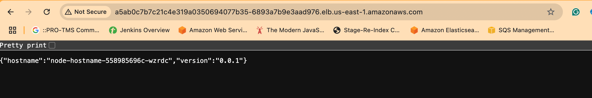
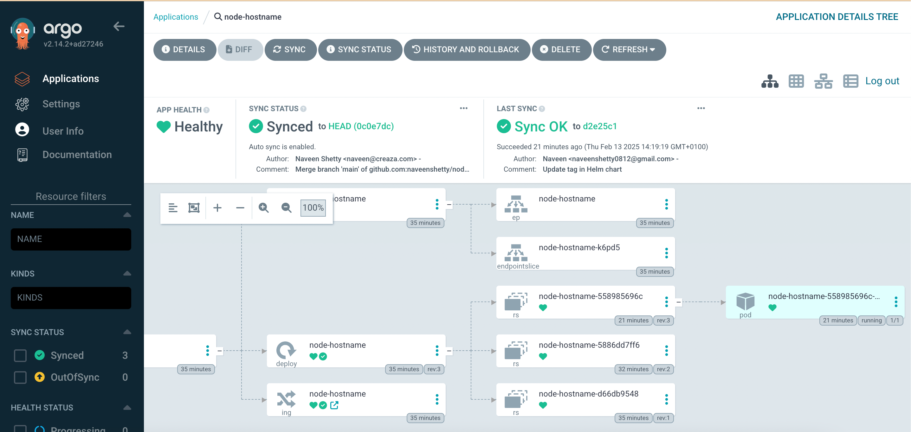

# Node Hostname Application

This repository contains the Node.js application for handling hostname requests. The application has been Dockerized, pushed to Docker Hub, and deployed to an EKS cluster using Helm and ArgoCD for continuous deployment.

## Table of Contents

- [Technologies Used](#technologies-used)

## Technologies Used

- **Node.js**: JavaScript runtime for building the application.
- **Docker**: For containerizing the Node.js application.
- **Helm**: For managing Kubernetes charts.
- **ArgoCD**: For Continuous Deployment (CD) to AWS EKS.
- **AWS EKS**: For managing Kubernetes clusters in AWS, ASG in place for high availablity.

- **Some picture:** 
- 
- 
- 

What’s Left to Do:
Optimize Auto Scaling Policies:
Make sure to Auto Scaling policies are based on resource usage (like CPU and memory) or application-specific metrics. For example, if traffic increases, the ASG should scale up EC2 instances to meet demand.
Review and fine-tune the scaling triggers, thresholds, and cooldown periods to avoid too many scale-up or scale-down actions happening in a short period.

